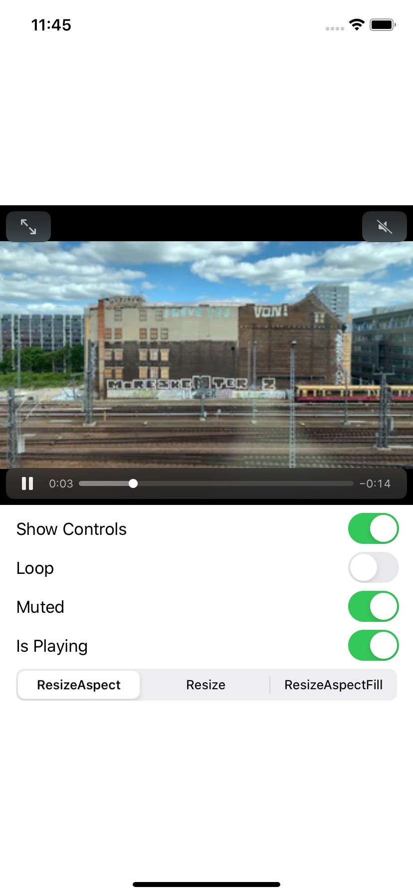

# SVEVideoUI

SVEVideoUI provides SwiftUI view that diplays videos.



## Installation

SVEVideoUI is available through [Swift Package Manager](https://swift.org/package-manager/). To install
it, simply add the following line to your `Package.swit`:
```
dependencies: [
.package(url: "https://github.com/SergioEstevao/SVEVideoUI.git", from: "0.2.0")
]
```
## Usage

To use the video player do the following:

```` swift
import SVEVideoUI
struct VideoPlayerView: View {
    var videoURL = Bundle.main.url(forResource: "video", withExtension: "mp4")!    

    var body: some View {        
            Video(url: videoURL)                            
    }
}
````

If you want to mute the sound on the video you just need to do
```` swift
Video(url: videoURL).isMuted(true)
````

And to hide the video controls
```` swift
Video(url: videoURL).playbackControls(true)
````

To loop the video
```` swift
Video(url: videoURL).loop(true)
````

### Sample Project

To run the example project, clone the repo, and open the `SVEVideoUI.xcproject` file

## Requirements

 * AVFoundation
 * SwiftUI
 * XCode 11 or above
 * iOS 13 or above
 * macOS 10.15 or above

## Getting in Touch

If you have questions about getting setup or just want to say hi, just drop an issue on Github with your request.

## Author

[Sérgio Estêvão](https://sergioestevao.com)

## License

SVEVideoUI is available under the MIT license. See the [LICENSE file](./LICENSE.md) for more info.
